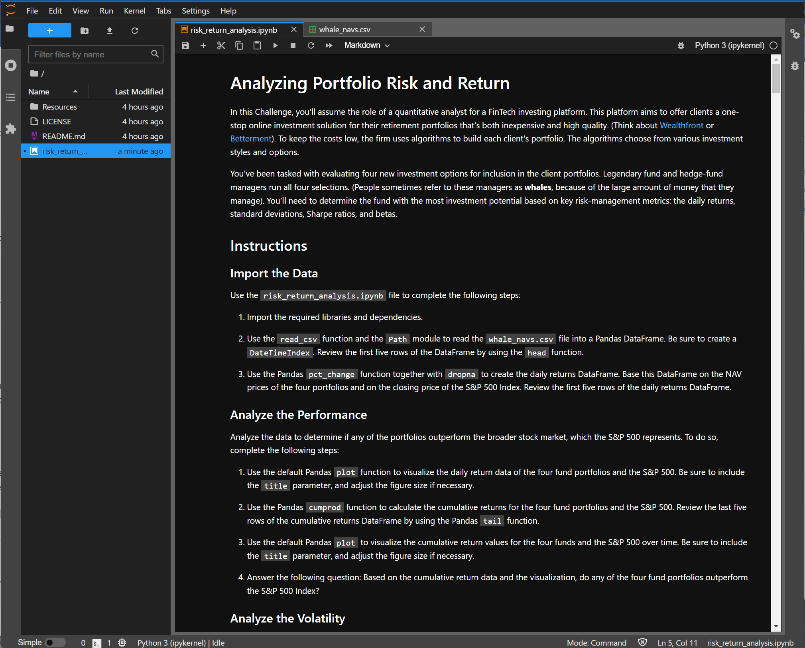

# Portfolio Risk Return Analysis


An analysis summarized in a Jupyter notebook comparing a group of 4 portfolio funds from 10/2014 - 09/2020 using cumulative annualized returns, volatility, annualized volatility, SMA volatility, Sharpe ratios, and a 60-day rolling average of Beta against the S&P 500.  

---
## Technologies

This project is written using a ```Jupyter Lab 3.2.1``` notebook running  ```Python 3.7.11```.  Key libraries include ```pandas 1.3.5``` for importing and analyzing the data from csv files,```matplotlib 3.5.0``` for plotting the data, ```numpy 1.20.3``` for basic math functions, and the standard python package for file name management ```pathlib```.

---

## Installation Guide

Before running the application, first install the following packages if you don't already have them installed in your development environment.

```python
  pip install jupyterlab
```
After installation, ```cd``` into the top folder of the repository.  Then open ```Jupyter Lab``` by typing:
```python
jupyter lab
```
This should open an instance of Jupyter lab in your default explorer applicaiton.  The report and analysis are in the jupyter notebook file named ```risk_return_analysis.ipynb```.  Open this file and the contents form the basis of the report.

---

## Usage

This Jupyter notebook is intended as an analysis for a group of 4 investment portfolios based on previous historical performance against the S&P 500.

To view the analysis, open up a gitbash or terminal in the top folder of the cloned repository.  To view the analysis, open the ```risk_return_analysis.ipynb``` file, which should look like the displayed version below:



Simply run the Kernel and the results/analysis will populate the report.

## Data Set Information

The data used in this report was provided in the course materials of a UC Berkeley Extension program.  The data file is located in the ```Resources``` directory and is named ```whale_navs.csv```.  The first column of the file contains the date incremented by day from a time period between October 1st, 2014 - September 11th, 2020.  The next four columns are the daily net asset value prices (NAV) for each of the 4 portfolio funds considered in this analysis, which are:
1) SOROS FUND MANAGEMENT LLC
2) PAULSON & CO.INC.
3) TIGER GLOBAL MANAGEMENT LLC
4) BERKSHIRE HATHAWAY INC.  

The last column is the daily close price of the S&P 500.  

---

## Contributors

The seed code is from the course material from a UCBerkeley Extension program.  This analysis is written and performed by John Gruenewald.<br><br>
For more information, contact **John Gruenewald**:<br>
**e-mail:** [john.h.gruenewald@gmail.com](mailto:john.h.gruenewald@gmail.com)<br> **linked-in:**  [jhgruenewald](https://www.linkedin.com/in/jhgruenewald/)<br>**twitter:**  [@GruenewaldJohn](https://twitter.com/GruenewaldJohn)<br>**medium:**  [@comput99](https://medium.com/@comput99)

---

## License

MIT License

Copyright (c) 2022 John Gruenewald
